## FRONTEND FILMBOX

:wave: Soy Raquel Moya. 
:computer: Soy una estudiante de FSD en <kbd>⇥</kbd>  

---

- [Sobre el proyecto](#about)   

- [Instrucciones](#instructions)

- [Features](#features)

- [Tecnologías](#tools)

- [Developers](#developers)

---

## Sobre el proyecto

Este proyecto consiste en replicar la parte Frontend de un servicio de alquiler de películas trabajando sobre el Backend que podéis encontrar en el siguiente enlace :
https://github.com/RaquelMoya/BackMovies 

A continuación encontraréis detallados cada una de las funcionalidades de este proyecto.

## Instrucciones 🔧

Dado que hemos deployado el Frontend en AWS, y el backend junto con la BBDD en Heroku, podemos acceder a la app de forma remota con el siguiente enlace:
https://master.d26c8aov44o1cy.amplifyapp.com

Si por el contrario, queremos acceder a la app de manera local, deberíamos seguir las instrucciones de instalación local del backend plasmadas en el readme del proyecto en https://github.com/RaquelMoya/BackMovies y, posteriormente, clonar este repositorio localmente.
una vez clonado, deberemos instalar las dependencias no incluidas por el archivo .gitignore:

### `npm i`

Posteriormente, deberíamos modificar la raíz existente en cada endpoint en Components y Containers, para trabajar a nivel local. Dado que en el backend tenemos establecido el PORT = 3500 si trabajamos en local, deberemos modificar todas las raices de los endponts a http://localhost:3500/ en lugar de https://backendfilmbox.herokuapp.com/ 

### `npm run dev` ó `npm start`

y ya podríamos acceder a la app sin utilizar el deploy. 

A continuación, detallamos todas las funcionalidades que podemos encontrar en la app.

## Features

Cuando iniciamos la app, nos lleva a la vista Home, donde podemos hacer login, o registrarnos. En la barra superior de la pantalla, podremos buscar películas por género o por título, y encontraremos tambien botones de acceso a registro, login o a todas las películas.  
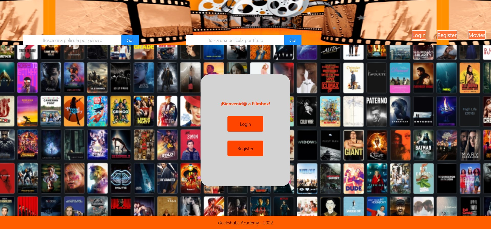

Para registrarnos, debemos clickar sobre register y nos redirigirá a la vista de registro, donde podremos introducir nuestros datos para crear un usuario. Los campos a rellenar tienen un pequeño control de expresiones que nos avisará si no se han rellenado correctamente dichos campos. 

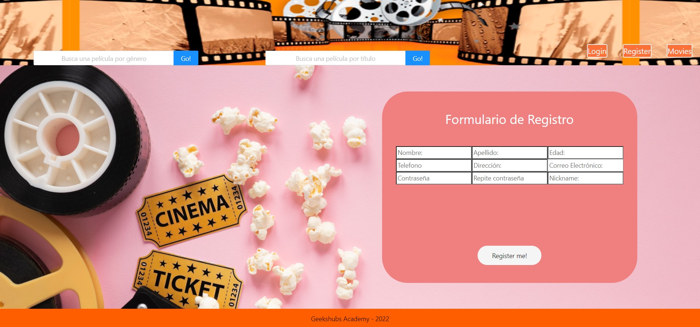

Una vez nos hemos registrado, nos redirigirá a la vista de Login, donde deberemos introducir nuestro email y nuestro password con los que nos hemos registrado previamente. 

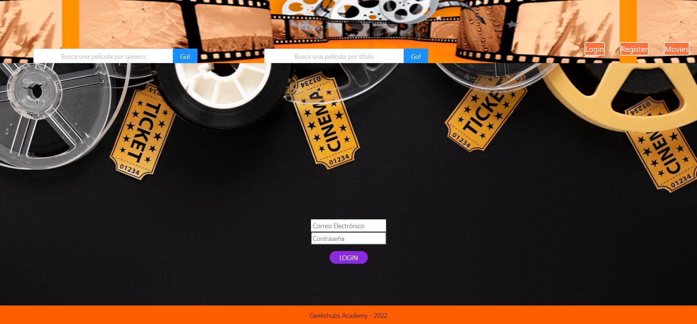

Al registrarnos, nos redirigirá a la vista de Profile, donde podremos modificar nuestros datos de usuario, ver los pedidos (Orders) que tenemos realizados, o ver las películas existentes. También veremos como en la barra superior aparece un botón con el nombre de usuario desde el que podremos volver a nuestro Profile, un botón para hacer Logout y volver a Home, y otro para acceder a nuestros pedidos.

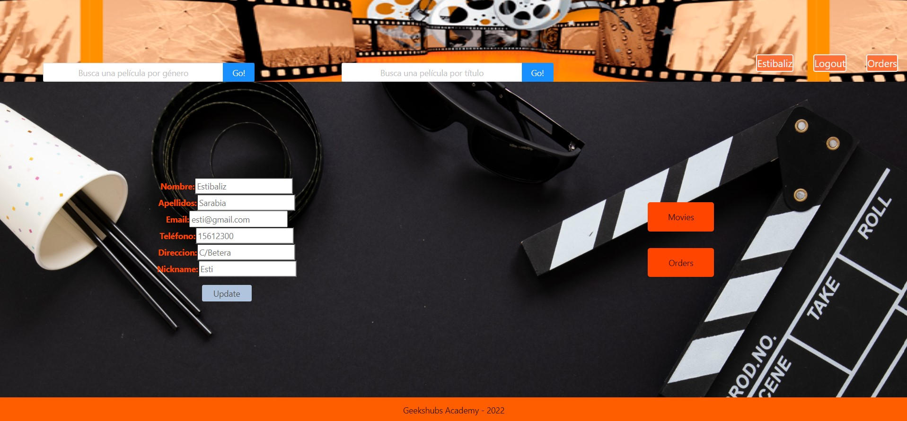

Para realizar un pedido nuevo, clickamos en el botón Movies y nos redirige a la vista de Movies. 

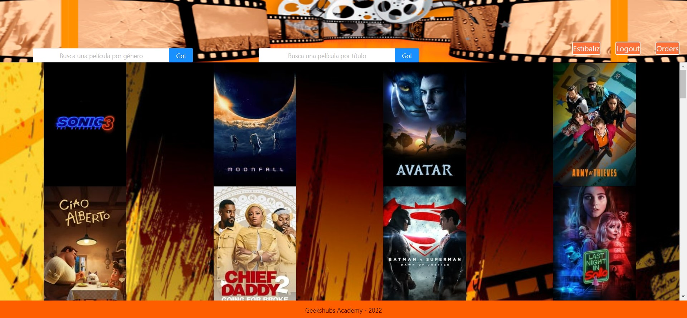

Podemos clickar sobre una de las películas y ver los detalles. También podremos introducir la fecha en la que queremos alquilar la película y la fecha en la que queremos devolverla, y clickar en alquilar para realizar el pedido.

En caso de acceder a Movies y clickar sobre una película sin estar logueado, no aparecerían las fechas ni la opción de alquilar una película. 

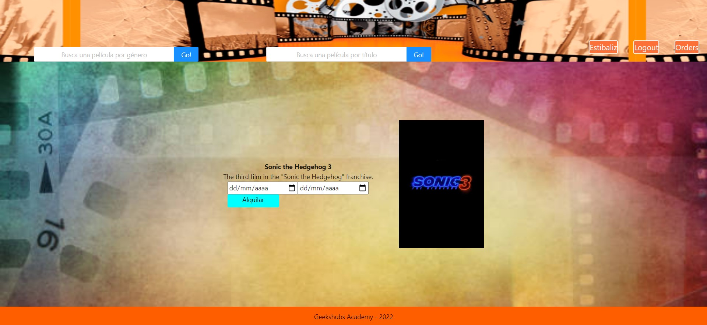

Al alquilarla, nos redirigirá a la vista de Orders, donde aparecerán los títulos de los pedidos que tenemos realizados.

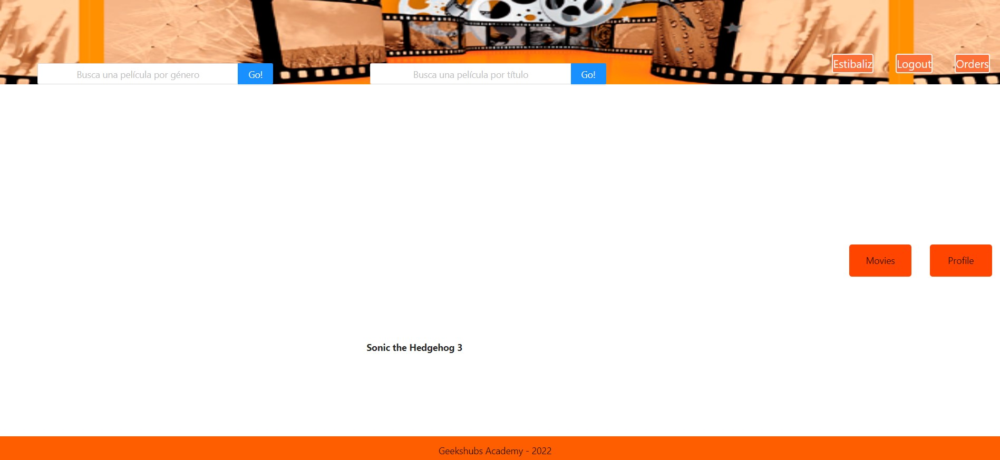

Si queremos buscar películas según el género que tengan asignado, podemos introducir en la barra de búsqueda correspondiente un género y ver los resultados. 

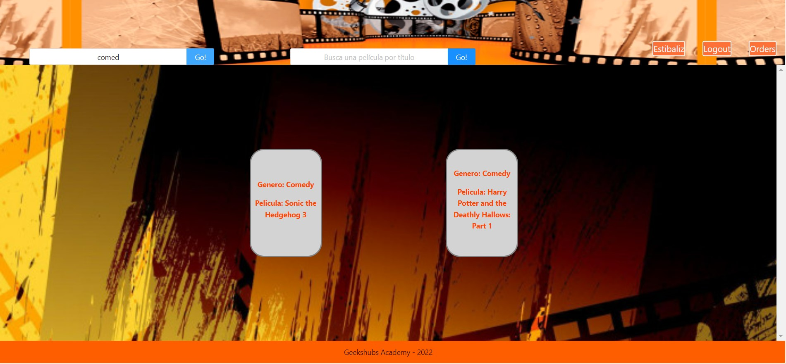

En caso de que quisiéramos buscar alguna película por título, podríamos introducirlo en la barra de búsqueda correspondiente y ver los resultados. En este caso, podríamos clickar sobre el resultado y nos llevaría a la vista de detalle de la película. 

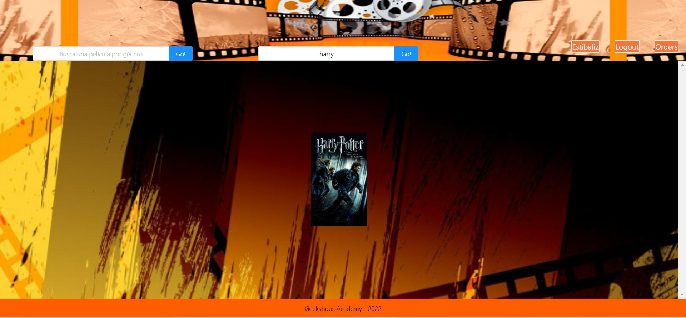

Si somos el perfil de Administrador, y queremos acceder a ciertas áreas a las que no tenemos acceso como usuario, debemos loguearnos con el email y el password del Administrador. En este caso nos redirigirá al Profile del Administrador. 

En nuestro Profile tendremos acceso a todos los usuarios clickando en Users. 

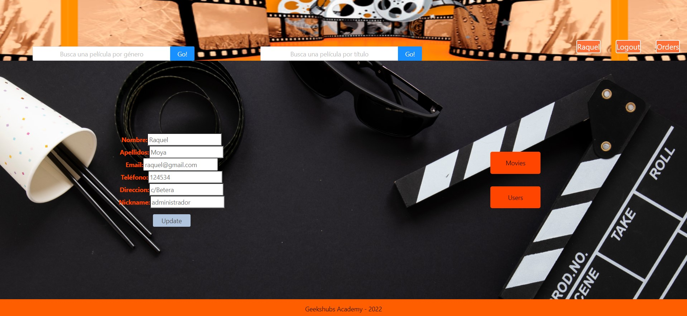

En la vista Users podremos ver a todos los usuarios registrados y eliminarlos.

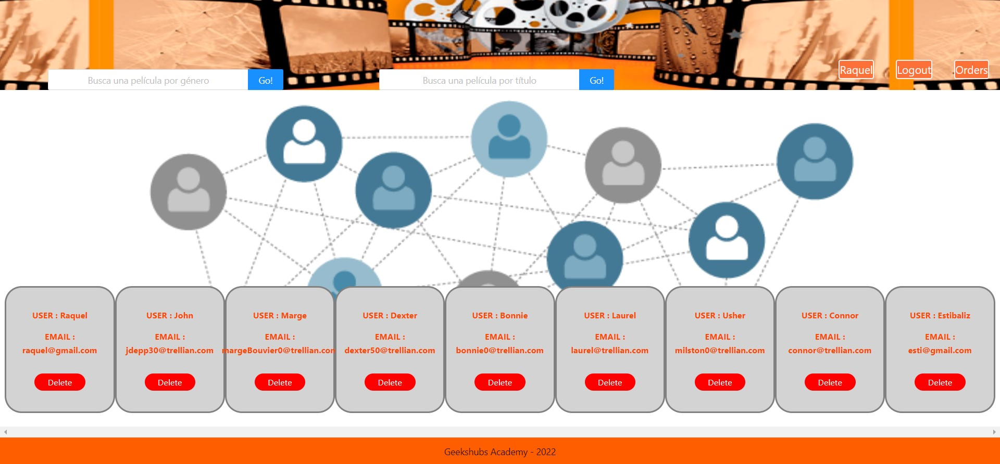

Si clickamos sobre Orders, en la barra superior, podremos ver todos los pedidos realizados por todos los usuarios, y borrarlos. 

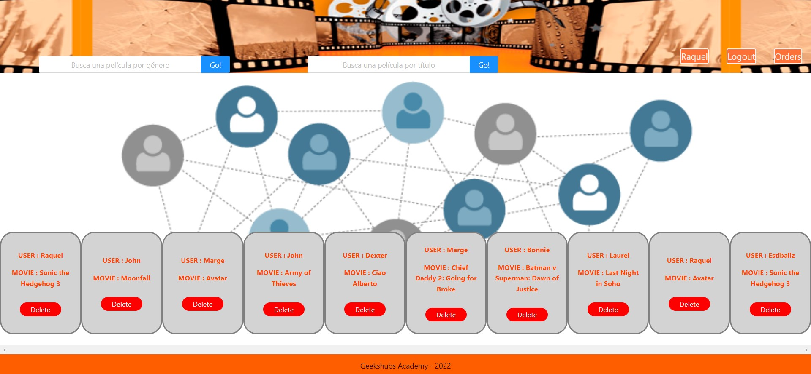

## Tecnologías y dependencias utilizadas

 

## Developers ✍️

[Raquel Moya](https://github.com/RaquelMoya)

Última edición: 20/03/2022